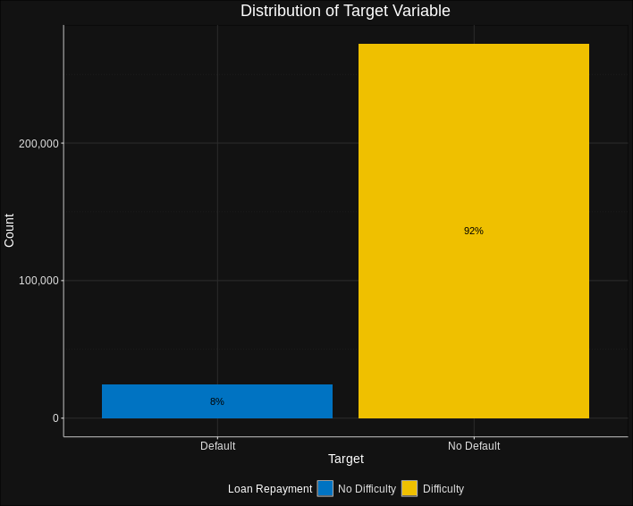

# Home Credit Default Risk Analysis

#### -- Project Status: [Active]

## Objective
The objective of this project is to predict potential credit repayment difficulties among clients using a robust machine learning model. The project is based on the dataset provided by Home Credit, a service dedicated to offering lines of credit (loans) to unbanked individuals.

## Overview
This study begins with the acquisition and merging of relevant datasets. Following a rigorous feature engineering process, a comprehensive dataset is created for model development. Several feature selection strategies, including Recursive Feature Elimination with XGBoost, Linear Discriminant Analysis, and Mutual Information Coefficient, are implemented. The machine learning models utilized include XGBoost and CatBoost, optimized using Hyperopt for hyperparameter tuning. The project concludes with a comprehensive evaluation of model performance, emphasizing precision, recall, and ROC-AUC metrics.

## Technologies & Methods
* Python
* Jupyter Notebook
* Scikit-Learn
* XGBoost
* CatBoost
* Pandas
* Hyperopt
* Data Preprocessing
* Feature Selection
* Machine Learning
* Hyperparameter Tuning
* Model Evaluation

## Project Requirements
* Data exploration
* Descriptive statistics
* Data preprocessing
* Data cleaning
* Feature selection and engineering
* Predictive modeling
* Hyperparameter tuning
* Evaluation metric interpretation

## Resources
1. Obtain the raw data [here](https://www.kaggle.com/c/home-credit-default-risk/data), courtesy of Kaggle's Home Credit Default Risk competition.
2. For data processing and transformation scripts, refer to the Jupyter notebooks within this repository.

## Key Deliverables
* [Notebook on Exploratory Data Analysis](link)
* [Notebook on Feature Selection and Classification Model](link)

---

# **Exploratory Data Analysis: Key Insights**

## **Target Variable: Loan Default**

Initial examination of the target variable - credit default, reveals a significant class imbalance. The "No Default" class dominates, accounting for around 91.8% of the total observations, while the "Default" class represents only a small portion of the dataset. This imbalance poses a challenge for predictive modeling, as it could lead to models that are biased towards predicting the majority class. Therefore, exploration of the factors influencing default rates is even more crucial.

## **Gender and Default**

The first exploration point was the relationship between gender and default rates. A Chi-Squared test revealed a statistically significant relationship, but the Cramer's V value suggested a weak association. Despite this, a stacked bar chart clearly showed that females are less likely to default compared to males, indicating that gender does play a role in default rates, albeit a small one.

## **Number of Children and Default**

The analysis then turned to the relationship between the number of children a client has and default rates. A statistically significant association emerged from the Chi-Squared test, despite the low effect size. Interestingly, the default rates seem to increase as the number of children increases, with the exception of certain categories with small sample sizes. This suggests that the financial burden of having more children might impact the ability to repay loans, but the trend is not consistent across all categories, indicating a need for further investigation.

## **Age and Default**

Age appears to be a significant determinant in loan default rates. A comparison of the median ages of defaulters and non-defaulters reveals that older applicants are less prone to defaulting on their loans. This trend could be attributed to a multitude of factors, such as more stable income sources or higher financial responsibility associated with older age. Interestingly, the youngest age group (20-38) exhibits the highest likelihood of loan defaults, suggesting an inverse relationship between age and default rates.

The adjacent table presents the findings of a logistic regression analysis that delves into the relationship between age and loan default. Here are the key takeaways:

- The "coef" column represents the estimated impact of age on loan default. A negative coefficient implies that an increase in age corresponds to a decrease in the chances of loan default. Specifically, for each additional year of age, the odds of default decrease by approximately 2.5% (calculated as (e^(-0.0249) - 1) * 100), where -0.0249 is the estimated coefficient for age.
- The "P>|z|" column provides the p-value, which signifies the significance of the relationship. In this instance, the p-value is extremely small, indicating a potent association between age and loan default.
- The analysis infers that older individuals exhibit a lower likelihood of defaulting on loans compared to their younger counterparts. This is quantified by the logistic regression model, which estimates how a change in age affects the probability of default.
    

    

## **Occupation, Gender, and Default**

The analysis examined the interplay between occupation, gender, and default rates. On average, males earn more across all occupation types. However, despite having higher incomes, males have a higher probability of default in both the privileged and underprivileged groups. This counterintuitive finding suggests that income is not the only factor influencing default rates, and that gender dynamics may play a role as well.

## **Conclusion, Further Investigation, and Recommendations**

The exploratory data analysis of the Home Credit dataset has revealed key insights into the factors influencing loan default rates, including gender, number of children, age, and occupation. These relationships are complex and sometimes counterintuitive, highlighting the need for a more nuanced understanding of loan default risk.

Several areas warrant further investigation. For instance, the relationship between the number of children and default rates is inconsistent across categories, suggesting the need for a more detailed analysis incorporating factors such as income and age. Additionally, despite higher incomes, males have higher default rates, indicating other underlying factors at play. Future analysis could explore the role of variables such as education level, marital status, and employment stability.

The findings have significant implications for Home Credit and other lending institutions. They underscore the importance of considering a range of factors when assessing loan default risk. Certain groups, such as young males and individuals with a large number of children, may be at higher risk of default. These insights could be used to develop targeted interventions and enhance predictive models for loan default.

In summary, this analysis not only enhances the understanding of credit risk but also provides valuable direction for future research and practical interventions.

