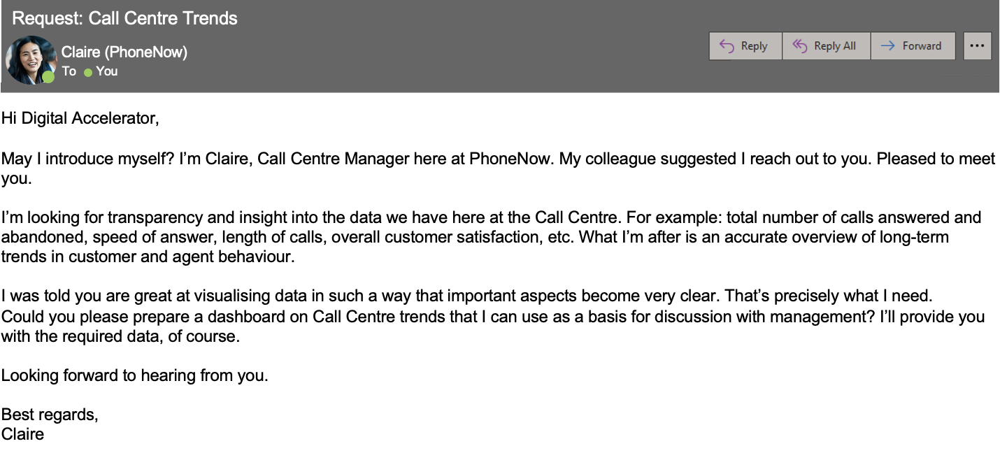
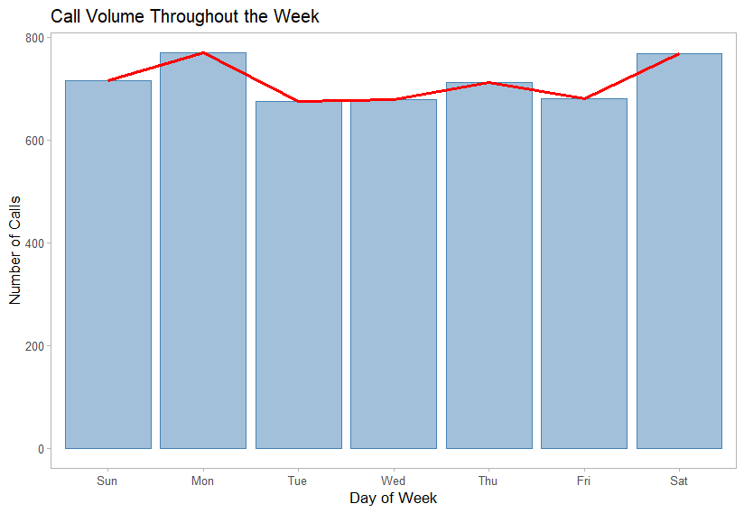
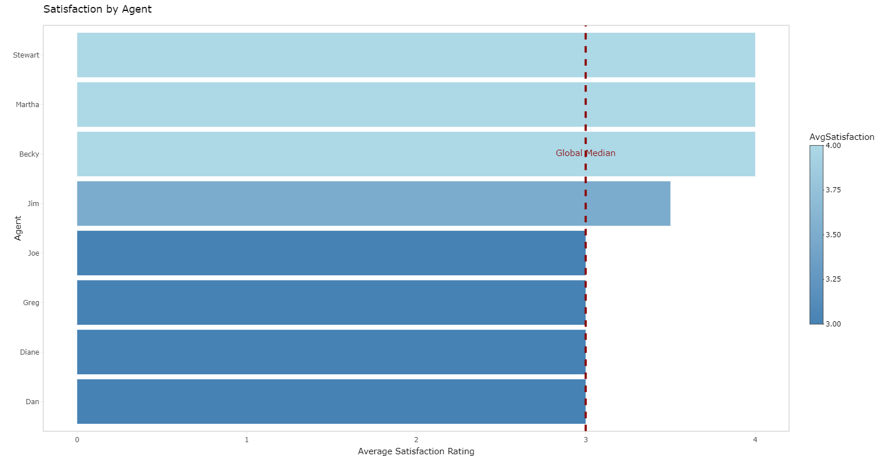
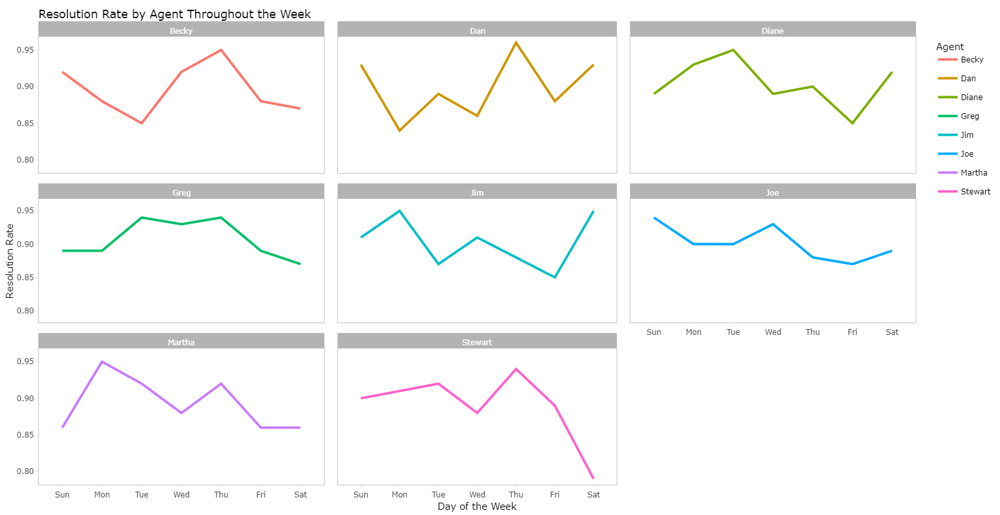
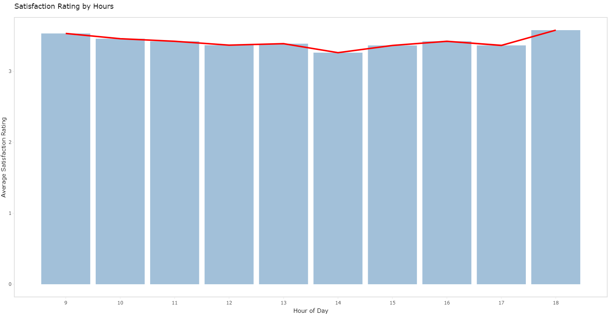
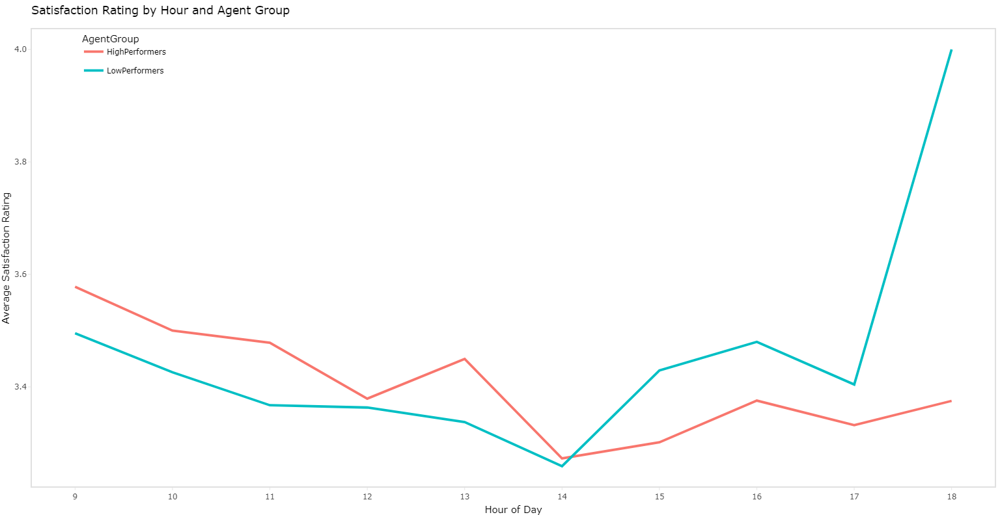
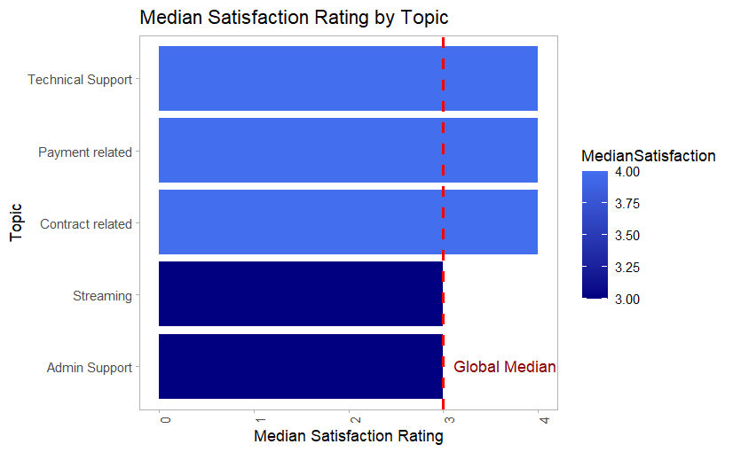
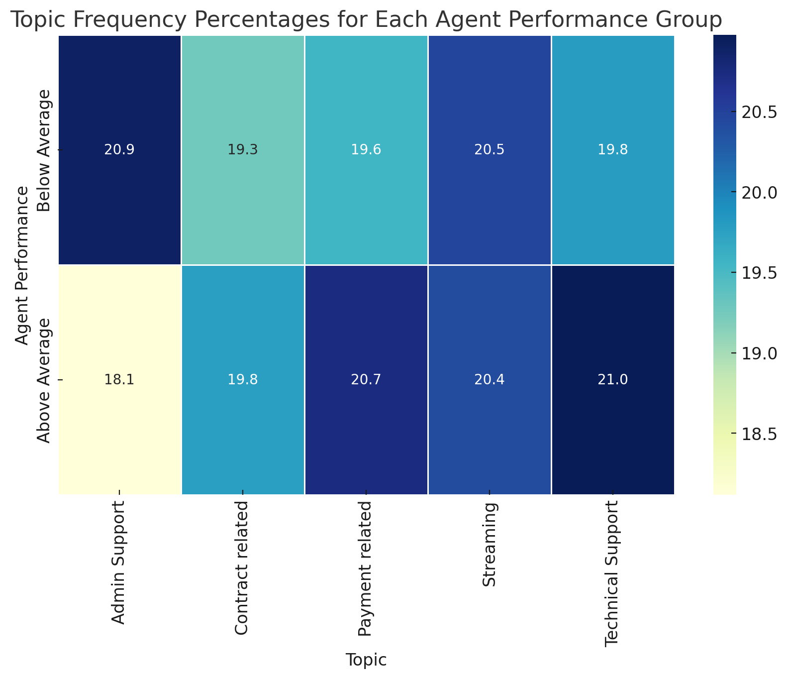
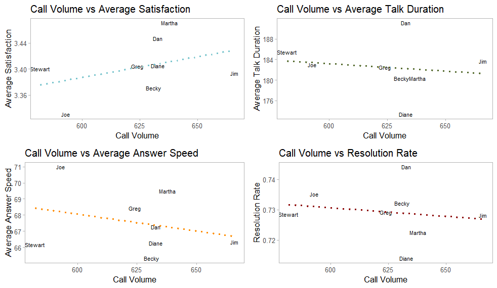
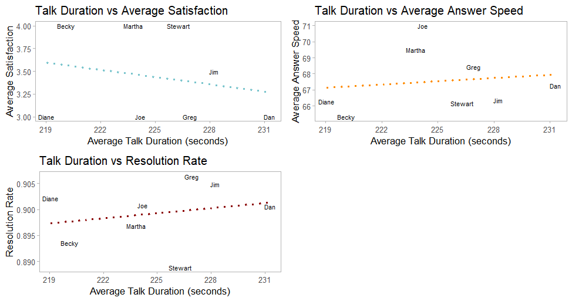

# Harnessing Data for Call Center Excellence: An Exploration of Telecom Customer Service

## Executive Summary

***This project analyzes call center data from a major telecom company, focusing on call volumes, agent performance, and customer satisfaction. Key findings include an 81% response rate to 5000 customer calls in Q1 2021, with room for improvement in unanswered calls. Agent performance was generally strong, but variations in customer satisfaction suggest differences in call handling. Factors such as the day of the week and the agent's personal schedule may influence performance. Customer satisfaction was highest at the start and end of the workday, with a dip around 2 p.m. The analysis found weak associations between call volume and agent performance metrics, suggesting that the number of calls an agent handles does not primarily determine their performance. Further analysis is required to fully understand and optimize agent performance and customer satisfaction.***

## Introduction

In the fiercely competitive telecom industry, understanding customer preferences is vital for success. Each call that lands in a call center represents not just a customer service interaction, but also an opportunity to understand customer behavior and preferences. As part of a personal project, I decided to delve into the data from a major telecom industry player's call center.

Claire, a Call Centre Manager at a telecom company, seeks transparency and insight into their call center operations. She believes that accurately tracking and analyzing metrics such as the total number of calls answered and abandoned, speed of answer, length of calls, and overall customer satisfaction can offer an overview of long-term trends in customer and agent behavior.

In response to Claire's challenge, I explored this call center dataset, examining these key metrics in depth. My goal was to create a comprehensive analysis that visually communicates these trends, providing a strong basis for strategic discussions with management. Through this article, I aim to demonstrate how data visualization can turn raw call center data into actionable insights, driving informed decision-making in telecom customer service management.

## Analysis and Results

### Examining Call Volumes and Resolutions: A Three-Month Snapshot

During the first quarter of 2021, the team handled a total of 5000 customer calls. Out of these, 4054 were answered, equating to a robust response rate of 81%. However, the remaining 946 calls went unanswered, pointing to a potential area of improvement for elevating customer satisfaction and retention rates.

A detailed monthly analysis reveals:

| Month | Total Calls | Answered Calls | Unanswered Calls | Answer Rate | Resolved Calls | Unresolved Calls | Resolution Rate |
| --- | --- | --- | --- | --- | --- | --- | --- |
| Jan | 1772 | 1455 | 317 | 82.1% | 1311 | 461 | 74.0% |
| Feb | 1616 | 1298 | 318 | 80.3% | 1161 | 455 | 71.8% |
| Mar | 1612 | 1301 | 311 | 80.7% | 1174 | 438 | 72.8% |

The interconnectedness between call answering and resolution becomes apparent here. Mirroring the response rate, the team successfully resolved every answered call, emphasizing the direct correlation between customer access to an agent and problem resolution.

Now, let’s go deeper starting from how the call volume behaves throughout the week. From the bar chart below, we can see that call volumes are at their highest on Monday and Saturday.

### Agent Performance

Let's investigate agent performance. Overall, each agent demonstrated impressive competency, with each handling between 477 to 536 calls over the three-month period. The average satisfaction score, talk duration, answer speed, and resolution rate all show slight variations among agents but still fall within a close range. These indicators collectively paint a picture of a team of agents who are not only capable of managing a significant volume of calls but are also efficient at resolving the issues raised during these calls.

From the above chart, it can be inferred that agents Becky, Martha, and Stewart have the highest median satisfaction rating of 4, while the rest have lower ratings, with Jim standing out at 3.5. This indicates that there may be differences in the handling of customer calls by different agents, leading to varying levels of customer satisfaction.

Analyzing the performance by the day of the week uncovers some intriguing patterns.

- **Becky** consistently maintains a stable resolution rate throughout the week, with a noticeable peak on Sundays.
- **Dan** exhibits his strongest performance on Sundays, but faces a slightly challenging start to the week with lower rates on Mondays.
- **Diane**'s performance fluctuates, reaching its zenith on Tuesdays and encountering more challenges on Sundays.
- **Greg**'s resolution rate remains steady across the week, with a slight uptick on Wednesdays.
- **Jim** achieves his highest success rate on Tuesdays, while Sundays seem to present more challenges.
- **Joe** kicks off the week strongly, peaking on Sundays, but experiences a slight downturn on Tuesdays.
- **Martha** excels at the beginning of the week, particularly on Mondays, but tends to face more difficulties on Sundays.
- **Stewart** showcases the highest resolution rate on Mondays, with a significant dip on Saturdays.

These observations suggest that the day of the week may influence agent performance. This could be attributed to a myriad of factors, including the volume of calls received, the nature of the calls, the agent's personal schedule, and even their diet. For instance, an agent's diet could impact their energy levels and cognitive function, which in turn could influence their performance. To determine the underlying causes of these trends, further analysis and additional data on agents' behavior, such as their work shifts, rest periods, workload distribution throughout the week, and dietary habits, are required.

## Customer Satisfaction

Customer satisfaction is a key performance indicator for any call center. Hence, I investigated the overall satisfaction rating, how it changes over time, and the average satisfaction rating for each agent.

The analysis revealed some interesting trends. Customer satisfaction appears to be highest at the start and end of the workday, with ratings of 3.54 and 3.58 at 9 a.m. and 6 p.m., respectively. This could potentially be due to agents being more refreshed and ready to tackle customer queries at the start of the day, and keen to resolve remaining issues towards the end of the day.

Interestingly, the lowest average satisfaction rating (3.27) was observed at 2 p.m., which might indicate a post-lunch dip in agent performance or customer mood.

This hourly breakdown of satisfaction ratings offers valuable insights that can help in optimizing call center operations. For instance, specialized training can be provided to agents to handle the post-lunch dip effectively, or schedules can be adjusted to ensure that the most skilled agents handle calls during these critical hours.

## Satisfaction Rating by Time and Agent Group

Analysis on satisfaction ratings, the hour of the day, and agent groups revealed intriguing trends. Both High-Performers and Low-Performers start the day with nearly identical satisfaction scores around 3.5 at 9 AM.

High-Performers maintain a steady level of satisfaction throughout the day, staying around the 3.4 mark. In contrast, Low-Performers experience a dip, reaching their lowest point around 2 PM, suggesting that the afternoon might be a challenging period for this group.

Surprisingly, Low-Performers make a notable recovery by the end of the day, reaching a satisfaction score of 4 at 6 PM, surpassing the High-Performers. This poses an intriguing question: what strategies are Low-Performers employing in the late afternoon to boost satisfaction, and can these be applied earlier in the day?

These findings present valuable insights for targeted training and scheduling strategies to optimize customer satisfaction at all times.

## Satisfaction Ratings by Topic

The bar chart below represents the average satisfaction ratings for each topic.

It's intriguing to observe the similarities between this chart and the previously discussed agent performance chart. Three topics - Technical Support, Payment, and Contract - exhibit strong performance, with satisfaction ratings surpassing the global median of 3. Conversely, Streaming and Admin Support are areas that could use improvement, as they have median satisfaction scores slightly below the global median.

## Satisfaction Ratings by Topic and Age Group

The following heatmap illustrates the distribution of topics across different agent performance groups, with performance gauged by satisfaction rating. Each cell's value signifies the percentage of calls pertaining to a specific topic, handled by agents within each performance group.

Key observations from the heatmap include:

- Agents whose performance falls below average tend to handle a slightly higher percentage of "Streaming" calls compared to their above-average counterparts.
- In contrast, agents demonstrating above-average performance manage a greater percentage of "Admin Support", "Contract related", and "Payment related" calls.
- The distribution of "Technical Support" calls is fairly consistent across both performance groups.

These findings hint at a potential correlation between call topics and agent performance. However, additional statistical analysis would be required to substantiate this hypothesis.

## **Investigating the Correlation Between Metrics**

To explore the potential relationship between an agent's call volume and their performance, I conducted a detailed analysis centered on four key performance indicators: Average Satisfaction Score, Average Talk Duration, Average Answer Speed, and Resolution Rate.

| Metrics | p_values | Correlation Coefficients |
| --- | --- | --- |
| AvgSatisfaction | 0.3379 | 0.3912194 |
| AvgTalkDuration | 0.7196 | -0.1518869 |
| AvgAnsSpeed | 0.4942 | -0.284765 |
| ResolutionRate | 0.6894 | -0.1688096 |

The table above summarizes the findings. It presents the p-values and correlation coefficients for each metric in relation to call volume. The p-value estimates the probability of observing the given correlation under the null hypothesis (no correlation). The correlation coefficients provide insights into the strength and direction of the relationship between call volume and the various performance indicators.

Interestingly, the correlation analysis reveals only weak associations between Call Volume and these performance metrics. Moreover, none of these correlations achieved statistical significance. This suggests that the available data does not provide strong evidence to support the notion that an increase in call volume significantly influences these aspects of agent performance, either positively or negatively.

However, these results do not entirely rule out the possibility of such effects. More extensive data and a deeper analysis may uncover nuanced relationships or specific conditions under which call volume might impact performance. Yet, the current investigation suggests that the sheer number of calls an agent handles is not a primary determinant of their performance across these selected metrics.

A similar analysis was conducted on Average Talk Duration, leading to a comparable conclusion. The results are tabulated below:

| Metrics | p-value | Correlation Coefficient |
| --- | --- | --- |
| Average Satisfaction | 0.60 | -0.22 |
| Average Answer Speed | 0.74 | 0.14 |
| Resolution Rate | 0.59 | 0.23 |

1. **Average Talk Duration vs. Average Satisfaction Score:** The correlation between these variables was -0.22 (p = 0.60), indicating no statistically significant relationship.
2. **Average Talk Duration vs. Average Answer Speed:** The correlation coefficient was 0.14 (p = 0.74), also suggesting a lack of significant correlation.
3. **Average Talk Duration vs. Resolution Rate:** A correlation of 0.23 was observed (p = 0.59), which, like the previous relationships, does not imply a significant connection.

In conclusion, none of the tested correlations were statistically significant, suggesting that, based on the current data, average talk duration does not significantly influence these aspects of an agent's performance. However, it's crucial to remember that the absence of evidence is not evidence of absence. The lack of statistical significance does not necessarily mean that no relationships exist. Future studies with larger sample sizes or different conditions may yield different results.
