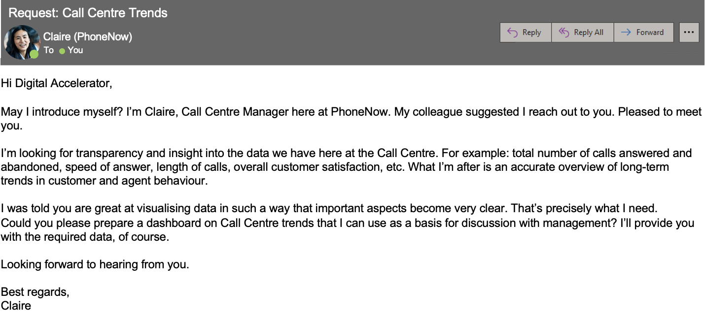

# Harnessing Data for Call Center Excellence: An Exploration of Telecom Customer Service

# Introduction

In the fiercely competitive telecom industry, understanding customer preferences is vital for success. Each call that lands in a call center represents not just a customer service interaction, but also an opportunity to understand customer behavior and preferences. As part of a personal project, I decided to delve into the data from a major telecom industry player's call center.

Claire, a Call Centre Manager at a telecom company, seeks transparency and insight into their call center operations. From the total number of calls answered and abandoned, to the speed of answer, length of calls, and overall customer satisfaction, she believes that these metrics, if accurately tracked and analyzed, can offer an overview of long-term trends in customer and agent behavior.

In response to this challenge, I decided to explore this call center dataset, examining these key metrics in depth. My goal was to create a comprehensive analysis that visually communicates these trends, providing a strong basis for strategic discussions with management. Through this article, I aim to demonstrate how data visualization can turn raw call center data into actionable insights, driving informed decision-making in telecom customer service management.

# **Analysis and Results**

## **Examining Call Volumes and Resolutions: A Three-Month Snapshot**

During the first quarter of 2021, the team handled a total of 5000 customer calls. Out of these, 4054 were answered, equating to a robust response rate of 81%. However, the remaining 946 calls went unanswered, pointing to a potential area of improvement for elevating customer satisfaction and retention rates.

A detailed monthly analysis reveals:

| Month | Total Calls | Answered Calls | Unanswered Calls | Answer Rate | Resolved Calls | Unresolved Calls | Resolution Rate |
| --- | --- | --- | --- | --- | --- | --- | --- |
| Jan | 1772 | 1455 | 317 | 82.1% | 1311 | 461 | 74.0% |
| Feb | 1616 | 1298 | 318 | 80.3% | 1161 | 455 | 71.8% |
| Mar | 1612 | 1301 | 311 | 80.7% | 1174 | 438 | 72.8% |

The interconnectedness between call answering and resolution becomes apparent here. Mirroring the response rate, the team successfully resolved every answered call, emphasizing the direct correlation between customer access to an agent and problem resolution.

Now, let’s go deeper starting from how the call volume behaves throughout the week. From below bar chart we can see that 

### **Agent Performance**

A critical aspect of the analysis was investigating agent performance. For this, I examined the number of calls each agent handled, their resolution rates, and their average speed of answer.

Taking a look at the overall performance, each agent demonstrated impressive competency, with each handling between 477 to 536 calls over the three-month period. The average satisfaction score, talk duration, answer speed, and resolution rate all show slight variations among agents but still fall within a close range. These indicators collectively paint a picture of a team of agents who are not only capable of managing a significant volume of calls but are also efficient at resolving the issues raised during these calls.

Breaking down the performance by the day of the week reveals some more specific patterns.

[https://firebasestorage.googleapis.com/v0/b/firescript-577a2.appspot.com/o/imgs%2Fapp%2FLearn_Data_Science%2FdaH1MJL1Of.html?alt=media&token=74d2cde0-0e6f-4b0b-8603-874f8c808542](https://firebasestorage.googleapis.com/v0/b/firescript-577a2.appspot.com/o/imgs%2Fapp%2FLearn_Data_Science%2FdaH1MJL1Of.html?alt=media&token=74d2cde0-0e6f-4b0b-8603-874f8c808542)

- **Becky** tends to maintain a fairly stable resolution rate throughout the week, peaking on Sundays.
- **Dan** demonstrates his best performance on Sundays and has a slightly challenging start to the week with lower rates on Mondays.
- **Diane** varies in her performance, demonstrating her best work on Tuesdays and facing more challenges on Sundays.
- **Greg**'s resolution rate holds steady throughout the week, with a minor peak on Wednesdays.
- **Jim** has his most successful day on Tuesdays while he seems to face more challenges on Sundays.
- **Joe** has a strong start to the week, with a peak performance on Sundays and a slight dip on Tuesdays.
- **Martha** does her best work at the start of the week on Mondays, while she tends to have a more challenging day on Sundays.
- **Stewart** displays the highest resolution rate on Mondays, with a notable dip on Saturdays.

Next, we can see the satisfaction rate for each agent. 

[https://firebasestorage.googleapis.com/v0/b/firescript-577a2.appspot.com/o/imgs%2Fapp%2FLearn_Data_Science%2FhY2LU1Cmde.html?alt=media&token=135e328c-3470-446a-8641-69b13280203f](https://firebasestorage.googleapis.com/v0/b/firescript-577a2.appspot.com/o/imgs%2Fapp%2FLearn_Data_Science%2FhY2LU1Cmde.html?alt=media&token=135e328c-3470-446a-8641-69b13280203f)

From the chart, it can be inferred that agents Becky, Martha, and Stewart have the highest median satisfaction rating of 4, while the rest have lower ratings, with Jim standing out at 3.5. 

This indicates that there may be differences in the handling of customer calls by different agents, leading to varying levels of customer satisfaction

### **Call Details**

Another key focus of the analysis was on call details. This encompassed metrics such as call volume over time, distribution of call topics, and the distribution of call durations. 

## **Customer Satisfaction**

Customer satisfaction is a key performance indicator for any call center. Hence, I investigated the overall satisfaction rating, how it changes over time, and the average satisfaction rating for each agent.

[https://firebasestorage.googleapis.com/v0/b/firescript-577a2.appspot.com/o/imgs%2Fapp%2FLearn_Data_Science%2FWiY72Y1F-l.html?alt=media&token=45216f92-ac45-41ca-ad0f-00fa1b74dfa2](https://firebasestorage.googleapis.com/v0/b/firescript-577a2.appspot.com/o/imgs%2Fapp%2FLearn_Data_Science%2FWiY72Y1F-l.html?alt=media&token=45216f92-ac45-41ca-ad0f-00fa1b74dfa2)

The analysis revealed some interesting trends. Customer satisfaction appears to be highest at the start and end of the workday, with ratings of 3.54 and 3.58 at 9 a.m. and 6 p.m., respectively. This could potentially be due to agents being more refreshed and ready to tackle customer queries at the start of the day, and keen to resolve remaining issues towards the end of the day.

Interestingly, the lowest average satisfaction rating (3.27) was observed at 2 p.m., which might indicate a post-lunch dip in agent performance or customer mood.

This hourly breakdown of satisfaction ratings offers valuable insights that can help in optimizing call center operations. For instance, specialized training can be provided to agents to handle the post-lunch dip effectively, or schedules can be adjusted to ensure that the most skilled agents handle calls during these critical hours.

According to the horizontal bar chart, the Streaming category has the highest average satisfaction rating of 2.82, while Technical Support has the lowest with an average rating of 2.7. Additionally, the topics of Admin Support, Payment Related, and Contract Related fall below the Streaming category in terms of average satisfaction rating.

## Satisfaction Rating by Time and Agent Group

Analysis on satisfaction ratings, the hour of the day, and agent groups revealed intriguing trends. Both High-Performers and Low-Performers start the day with nearly identical satisfaction scores around 3.5 at 9 AM.

High-Performers maintain a steady level of satisfaction throughout the day, staying around the 3.4 mark. In contrast, Low-Performers experience a dip, reaching their lowest point around 2 PM, suggesting that the afternoon might be a challenging period for this group.

[https://firebasestorage.googleapis.com/v0/b/firescript-577a2.appspot.com/o/imgs%2Fapp%2FLearn_Data_Science%2FAXXperzo5p.html?alt=media&token=ad6bc393-f919-464e-9d1e-b30a65e68746](https://firebasestorage.googleapis.com/v0/b/firescript-577a2.appspot.com/o/imgs%2Fapp%2FLearn_Data_Science%2FAXXperzo5p.html?alt=media&token=ad6bc393-f919-464e-9d1e-b30a65e68746)

Surprisingly, Low-Performers make a notable recovery by the end of the day, reaching a satisfaction score of 4 at 6 PM, surpassing the High-Performers. This poses an intriguing question: what strategies are Low-Performers employing in the late afternoon to boost satisfaction, and can these be applied earlier in the day?

To ensure the observation isn't influenced by fluctuations in call volume, I examined satisfaction ratings normalized by call volume. This confirmed that the dramatic end-of-day improvement for Low-Performers isn't due to decreased call volume. Indeed, the group's satisfaction scores still rise significantly at 6 PM even when factoring in the call volume.

[https://firebasestorage.googleapis.com/v0/b/firescript-577a2.appspot.com/o/imgs%2Fapp%2FLearn_Data_Science%2FEnTDeDr2eo.html?alt=media&token=00b22c06-06bc-4566-9f20-f129bc91df7d](https://firebasestorage.googleapis.com/v0/b/firescript-577a2.appspot.com/o/imgs%2Fapp%2FLearn_Data_Science%2FEnTDeDr2eo.html?alt=media&token=00b22c06-06bc-4566-9f20-f129bc91df7d)

Lastly, the consistent performance of High-Performers, even after normalizing for call volume, reinforces their ability to deliver high-quality service consistently throughout the day.

These findings present valuable insights for targeted training and scheduling strategies to optimize customer satisfaction at all times.

## Satisfaction Rating by Topics

Below is bar chart of average satisfaction rating for each topic.

## Satisfaction Rating by Topics and Age Group

Here is a heatmap showing the distribution of topics across agent performance groups, with the performance measured by satisfaction rating. The value in each cell represents the percentage of calls related to a particular topic handled by agents within each performance group.

Observations from the heatmap:

- Agents with below-average performance deal with a slightly higher percentage of "Streaming" calls than those with above-average performance.
- Conversely, agents with above-average performance handle a higher percentage of "Admin Support", "Contract related", and "Payment related" calls.
- The distribution of "Technical Support" calls is similar between both performance groups.

This suggests that call topics might be correlated with agent performance, but further statistical tests would be needed to confirm this

## ****Call Volume and Agent Performance****

In an attempt to decipher the relationship between an agent's call volume and their performance, I performed an in-depth analysis focusing on four key performance indicators: Average Satisfaction Score, Average Talk Duration, Average Answer Speed, and Resolution Rate.

| Metrics | p_values | Correlation Coefficients |
| --- | --- | --- |
| AvgSatisfaction | 0.3379 | 0.3912194 |
| AvgTalkDuration | 0.7196 | -0.1518869 |
| AvgAnsSpeed | 0.4942 | -0.284765 |
| ResolutionRate | 0.6894 | -0.1688096 |

Presented above is a summary the findings. The p-values and correlation coefficients displayed are for each metric in relation to the call volume. The p-value estimates the likelihood of obtaining the observed correlation assuming the null hypothesis (no correlation) is true. The correlation coefficients, on the other hand, give us insight into the strength and direction of the relationship between call volume and the various performance indicators.

Interestingly, the correlation analysis reveals only weak associations between Call Volume and these performance metrics. Furthermore, none of these correlations reached statistical significance. In other words, the data at hand does not provide compelling evidence to suggest that an increase in call volume significantly impacts these facets of agent performance, either positively or negatively.

However, it's worth noting that these results do not completely dismiss the possibility of such effects. More comprehensive data and a deeper dive into the analysis may reveal nuanced relationships or specific conditions under which call volume might have an impact on performance. Nonetheless, the current exploration suggests that the sheer number of calls handled by an agent is not a strong driving force behind their performance across these chosen metrics.

Similar analysis was done on AverageTalkDuration, which ends with similar conclusion. The result is tabulated below

| Metrics | p-value | Correlation Coefficient |
| --- | --- | --- |
| Average Satisfaction | 0.60 | -0.22 |
| Average Answer Speed | 0.74 | 0.14 |
| Resolution Rate | 0.59 | 0.23 |
1. **Average Talk Duration vs. Average Satisfaction Score:** The correlation between these variables was found to be -0.22 (p = 0.60), suggesting no statistically significant relationship.
2. **Average Talk Duration vs. Average Answer Speed:** The correlation coefficient here was 0.14 (p = 0.74), also pointing towards an absence of significant correlation.
3. **Average Talk Duration vs. Resolution Rate:** A correlation of 0.23 was observed (p = 0.59), which, similar to the previous relationships, does not indicate a significant connection.

In conclusion, none of the correlations tested were statistically significant, indicating that based on the current data, average talk duration appears to have no substantial impact on these aspects of an agent's performance. However, it's essential to remember that absence of evidence is not evidence of absence. The lack of statistical significance does not necessarily imply that no relationships exist. Future studies with larger sample sizes or different conditions may reveal different results.

