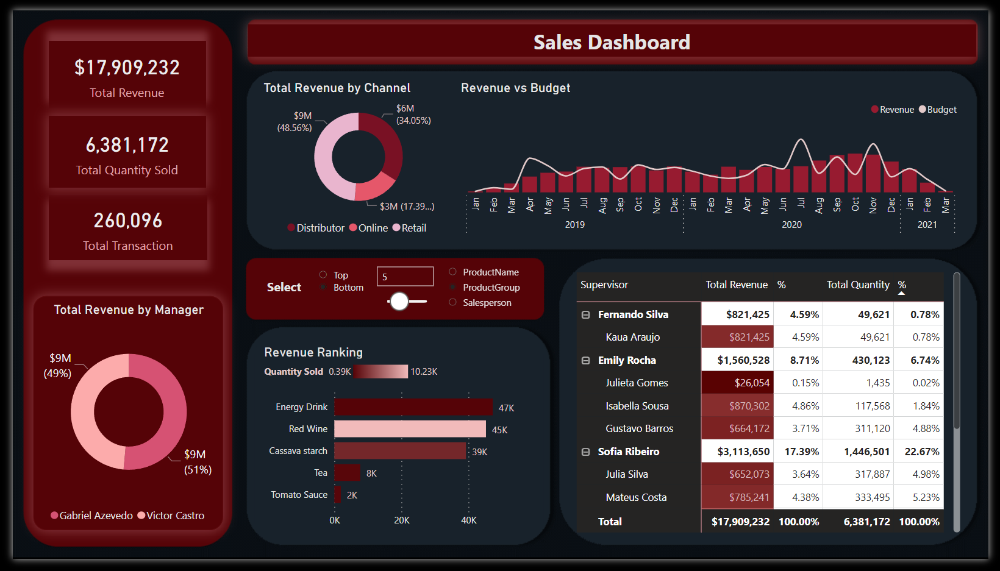

# Power BI Sales Data Dashboard

This repository contains the materials and resources for the Power BI Sales Data Dashboard Project

## Description

This project involves the use of Power BI to analyze and visualize sales data, providing insights into various metrics and KPIs. In addition, statistical analysis was carried out using R programming language.

This repository includes a Power BI report file (.pbix), a YAML file containing the linguistic schema, datasets, and R notebook.

---

## Analysis Summary:

This analysis explores a dataset of monthly sales from 2019 to 2021. The dataset includes key variables such as Total Revenue, Total Quantity Sold, Total Budget, Sales Person, Supervisor, Manager, Product Name, and Product Category.

The primary objective was to understand the relationship between budget allocation and revenue. A series of correlation analyses were conducted, including an examination of the relationships between revenue and other factors such as salesperson performance. 

Key Insights:

1. **Budget and Revenue Correlation**: A moderate positive correlation was found between the budget allocated to sales activities and the total revenue generated. This indicates that strategic increases in the sales budget could potentially contribute to revenue growth, although the correlation was not as strong as that observed between total quantity sold and total revenue.

|                 | TotalRevenue | TotalBudget | TotalQuantity |
|-----------------|--------------|-------------|---------------|
| TotalRevenue    | 1.0000000    | 0.5569627   | 0.9492535     |
| TotalBudget     | 0.5569627    | 1.0000000   | 0.5134846     |
| TotalQuantity   | 0.9492535    | 0.5134846   | 1.0000000     |

2. **Impact of Other Factors**: The ANOVA results indicated that the 'Month' and 'Salesperson' variables significantly influence 'TotalRevenue'. This suggests that both temporal factors (e.g., monthly variations, possibly due to seasonality) and individual salesperson performance can significantly affect revenue.

| Source        | Df  | Sum Sq    | Mean Sq   | F value | Pr(>F)      |
|---------------|-----|-----------|-----------|---------|-------------|
| Month         | 11  | 1.339e+11 | 1.218e+10 | 9.501   | 6.22e-14 ***|
| Salesperson   | 11  | 5.075e+11 | 4.614e+10 | 36.005  | < 2e-16 *** |
| Residuals     | 218 | 2.794e+11 | 1.281e+09 |         |             |

Note: 

- Significance codes:  0' *** , ' 0.001 '**' 0.01 '*' 0.05 '.' 0.1 ' ' 1

- The table displays the degrees of freedom (Df), sum of squares (Sum Sq), mean square (Mean Sq), F value, and the p-value (Pr(>F)) for each source of variation in the ANOVA model. Asterisks indicate the level of statistical significance, with more asterisks denoting higher significance.

3. **Monthly Budget Impact**: Correlation analysis revealed varying degrees of impact of the budget (TotalBudget) on revenue (TotalRevenue) across different months. The correlation was particularly strong in December, January, and May, indicating that strategic budget allocation in these months could be beneficial.

4. **Granger Causality Test**: The Granger causality test results suggest that changes in the sales budget may not be a reliable predictor of future changes in revenue, despite the significant correlation between budget and revenue. This suggests that other factors might play a more substantial role in influencing revenue.

|       | Res.Df | Df | F      | Pr(>F) |
|-------|--------|----|--------|--------|
| Model 1 | 237    |    |        |        |
| Model 2 | 238    | -1 | 0.0306 | 0.8613 |

Notes:
- Model 1 includes lagged values of both TotalRevenue and TotalBudget
- Model 2 includes only lagged values of TotalRevenue.
--- 
Summary: 
- Businesses should focus on agile budget allocation strategies, taking into account seasonal patterns and the performance of individual salespersons. 
- Given that the influence of budget on revenue is not predictive over time, they should consider other factors and potential non-linear relationships that might play a more significant role in driving revenue fluctuations.

---

## Contents

- `sales_data_analysis.pbix`: This is the Power BI report file. It contains the data model, queries, visualizations, and reports.
- `SalesDashboard.lsdl.yaml`: This YAML file contains the linguistic schema used in the project.
- `data/`: This directory contains the datasets used in the project. It includes:
  - `SalesData.xlsx`: The main sales data.
  - `Product.xlsx`: The product information data.
  - `Budget.xlsx`: The budget data.
  - `Photos.xlsx`: The photos data.
- `sales_analysis/`: This directory contains the R code used for statistical analysis.
  - `sales_analysis.Rmd`: This is the R notebook file. It contains the R code used in the project.

- `images/`: This directory contains the images used in the project.

## Usage

To view and interact with the report:

**Dashboard**
1. Open the `sales_data_analysis.pbix` file in Power BI Desktop.
2. Use the slicers and controls in the report to filter and drill down into the data.

**R markdown**
1. Open the `sales_analysis.Rmd` file in RStudio.
2. Run the code chunks to reproduce the analysis.

